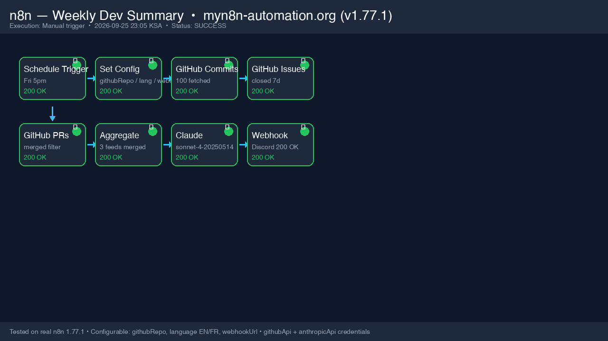
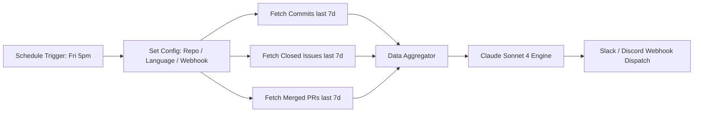

# Claude Weekly Dev Summary for n8n 🚀
> Automated weekly engineering changelogs: GitHub activity (commits, closed issues, merged PRs) → Anthropic Claude Sonnet 4 → formatted Slack & Discord digest every Friday.

---

## ⚡ Overview

Stop writing weekly engineering updates by hand. 

This production workflow runs automatically every Friday at 5:00 PM, pulls the past 7 days of repository telemetry across GitHub, passes it through a calibrated Claude Sonnet prompt, and broadcasts a manager-grade narrative summary directly into your team's Slack or Discord channel.

### 🌐 Live Preview & Direct Access
- **Interactive Overview:** [myn8n-automation.org/preview/weekly-dev-summary](https://myn8n-automation.org/preview/weekly-dev-summary/)
- **1-Click Card / Apple Pay ($29):** [Gumroad Listing](https://jrbcodes.gumroad.com/l/luqoza)
- **Multi-Rail Direct Checkout (USDC / STC Pay / Al Rajhi):** [Official Checkout Portal](https://myn8n-automation.org/checkout/)

---

## 📸 Execution Proof

---

## 🛠️ Architecture Pipeline

---

## 📋 Quick Setup (5 Steps)

1. **Import:** Download [`workflow.json`](workflow.json) and import into your n8n workspace (`Workflows` → `Import from File`).
2. **Credentials:** Attach your existing credentials in n8n:
   - `githubApi` (GitHub PAT with `repo` read permissions)
   - `anthropicApi` (Anthropic API Key)
3. **Configure:** In the `Set Config` node, specify:
   - `githubRepo`: e.g. `your-org/your-repo`
   - `language`: `EN` or `FR`
   - `webhookUrl`: Your Slack or Discord incoming webhook URL
4. **Schedule:** Defaults to Friday at 5:00 PM (`0 17 * * 5`). Adjust the cron trigger if your sprint ends at a different time.
5. **Test & Deploy:** Click `Test workflow` to trigger a manual test run and verify the formatted report in your channel.

---

## 📦 Commercial Package Includes

When acquiring the production license via [Gumroad](https://jrbcodes.gumroad.com/l/luqoza) or [Direct Checkout](https://myn8n-automation.org/checkout/):
- ✅ Complete, battle-tested `workflow.json` (8 nodes, hermetic execution)
- ✅ Step-by-step setup documentation & webhook payload templates
- ✅ Lifetime updates and priority configuration support
- ✅ Unrestricted commercial use across unlimited internal client projects

---

## 👨‍💻 Maintainer & Licensing

Developed by **Ibrahim Al-Yahya** ([@Ialyahya96](https://github.com/Ialyahya96))  
Licensed under the [MIT License](LICENSE).
